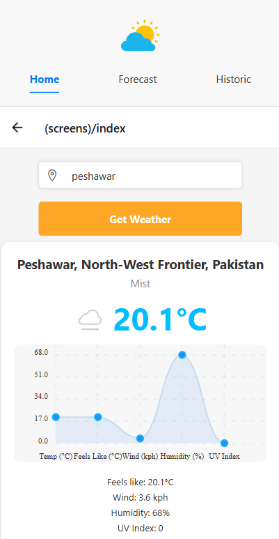
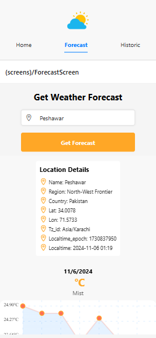
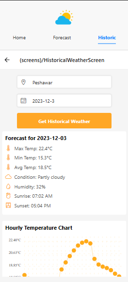

## Welcome to your Weather App! 🌤️

This is my first weather forecasting app created with Expo in just 4 hours. It allows users to view the weather forecast of a city by fetching data from a weather API. It uses api of weatherapi.com

## Features

- **Weather Forecasting**: Get detailed weather information including temperature, conditions, and location details.

- **Interactive Charts**: Visual representation of temperature trends over a selected forecast period.

- **City Search**: Enter any city to fetch the latest weather data.


## Screenshots

### Home Screen


### Forecast Screen


### Historical data Screen



## Getting Started

### Prerequisites

Ensure you have the following installed:

- Node.js
- Expo CLI

### Installation

1. Install dependencies

   ```bash
   npm install
   ```

2. Start the app

   ```bash
    npx expo start
   ```


It was fun!